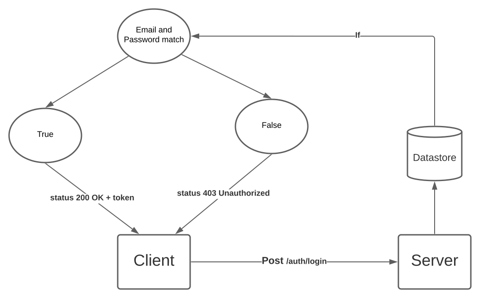
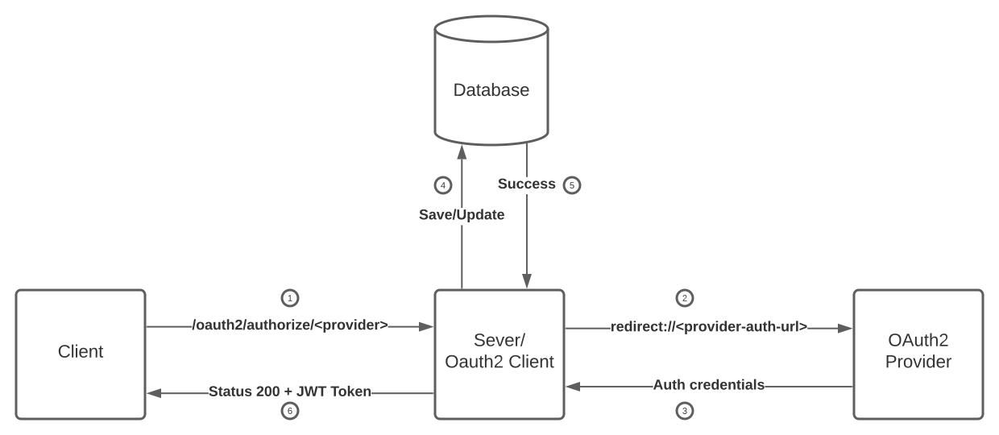
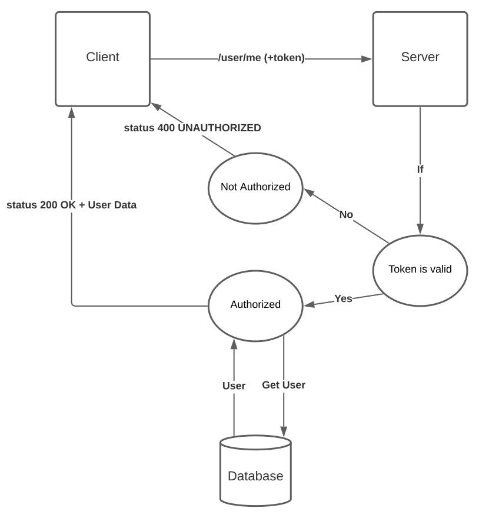

# Spring Boot OAuth2 Authentication (Password, Google, Github)

## Watch Live Demo

Click to watch youtube video 👆

## Design Overview

### Introduction

    This is the Design Document for Authentication Client created using
    Spring Boot Backend and React Frontend.

    It elaborates the technologies and processes used to successfully enable a secure Authentication
    for a user. So that only the authenticated user can access protected resource.

#### Technologies
<ul>
  <li>Backend
    <ul>
      <li>Spring Boot - Web Framework</li>
      <li>Data JPA - ORM</li>
      <li>Mysql - Database</li>
      <li>OAuth2</li>
    </ul>
  </li>
  <li>Frontend
    <ul>
      <li>React - Framework</li>
      <li>Axios - Http Client</li>
    </ul>
  </li>
  <li>Json Web Token - Communication between Server and Client</li>
</ul>

#### Overview

The application features a protected resource, which is equivalent to any the dashboard of other
    pages in a web application, which only authenticated user can view.

Two types of authentications are implemented:

<ul>
    <li>username and password authentication</li>
    <li>Oauth2 authentication with Github or Google</li>
</ul>

##### Email and Password Authentication

This type of authentication is two step process. First the user has to authorize the
credentials in the application's datastore. After that, the user can login with the provided
email and password.

            
##### Oauth2 Authentication

This is a single step authentication process. For this application, the user can authentication
withGithub and Google, but further third party authentication providers can be added. The user just has 
to login with their account without any signup and the rest is handled by the Oauth2authentication 
provider.

#### Processes
##### Signup

The new user Signup's with three credentials, namely:

<ul>
    <li>Fullname</li>
    <li>Email</li>
    <li>Password</li>
</ul>

    These credentails are submitted at the Server endpoint, <strong>/auth/signup</strong>, where
    these are registered in the application's users datastore. The stored credentials are userd for
    authenticating the user credentials when logging in.

The password is encoded by Password Encoder before being stored into the Datastore to improve the
    security. This application uses Bycrypt Encoder as the password encoder, which is build into the
    Spring Security framework. You can swap it with any other encoder of you choice.

    

Depending on the provided signup credentials, the request can either Pass or Fail:

###### Case 1: Pass

  The provided Email is not already registed, in which case a new user record is created in the 
  Datastore and the signup request is successful returning a <strong>200 OK</strong> status code.

###### Case 2: Fail

  The provided Email is already registered. This condition applies if any Oauth2 signed in accout 
  (Github or Google) provided the same email. It results in unsuccessful Signup request returning 
  <strong>400 Bad Request</strong> status code.

That's it for Signup.

##### Login

Login validates the user credentails and returns a token, which is stored by the client and is
used later to authenticate for access the protected resource. Login may pass or fail depending
on the user credentials. In case of failure, server returns status code <strong>403
Unauthorized</strong>, whereas status code <strong>200 OK</strong> is returned along with
the token if the login is successful.

###### Login using Email and Password

<ol>
  <li>User POST their Email and Password to the Server endpoint, <strong>/auth/login</strong></li>
  <li>server compares the provided email and password to the email and encrypted passord registered in the datastore.</li>
  <li>The credentials may be invalid or not even registered, the login request is failed in either case.</li>
  <li>If the credentials are valid, the server will generate an authentication token, 
    <a href="https://jwt.io">JSON Web Token</a> in this case. The token is saved by the client
    and sent further requests to access the protected resource(s).</li>
</ol>

###### Login with OAuth2 Provider

In this type of Authentication, the validation is handled by OAuth2 provider, Google and
Github API in this case. The provider authenticates the user and provides the authenticated
user's credentials. These are used by the server to create and return the token.

<ol>
  <li>Client sends a <strong>GET</strong> request to
    <strong>/oauth2/authorize/&lt;provider&gt;</strong>
  </li>
  <li>The request gets redirected to the chosen OAuth2 provider's url by the server, which
    in this context acts as authentication client. Here the entire authentication
    process is handled by the provider.</li>
  <li>On successful authentication, the authenticated credentials are returned to the
    server.</li>
  <li>The server saves the new credentials in the database or updates the existing
    credentials if necessary with the provided credentials.</li>
  <li>The save succeeds.</li>
  <li>Now the server encodes the credentials to generate the JSON Web Token, for
    authenticating further requests to protected resource. After all this successful
    processing, the Server returns a <strong>200 OK</strong> status code to the client
    along with the generated token. The client stores the returned token in any form of
    browser storage.</li>
</ol>

#### Accessing Protected Resource

  The client sends the request to access protected resource, this can be page in a web
  application that requires authentication to access. In this example, it is the home page on
  client, which makes GET Request to /user/me on server to get account information. This is
  equivalent to viewing your profile on Facebook, for example.

  The server checks for the provided access token (JWT in this case). If the token does not
  exist, or it is invalid, the server returns 400 UNAUTHORIZED status code. After receiving
  this response, the client is redirected to authenticate with valid credentials this time.
  Contrary to that, if the token contains valid credentials, the server fetches stored client
  data from the database and returns it as a JSON object. The Client uses this data to show
  the profile information to the user.

